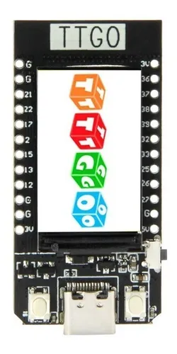

# Practica1_DisenoElectronico
La finalidad de esta practica consitia en implementar un circuito con nuestra placa de desarrollo TTGO esp32 y un sensor de temperatura y humedad, para esta primera practica ya que mi persona Moises Andres Perez Tamayo no poseia la placa de desarrollo, esta primera practica se realizo en grupo con Santiago Bermudez, al no poseer tampoco el sensor de temperatura y humedad, para medir una variable fisica se usó un sensor MQ-135 que detectarán gases como monóxido de carbono (CO), dióxido de carbono (CO₂), tolueno, amoníaco (NH₃) y acetona, para posteriormente transmitir los datos a la plataforma de UBIDOTS.  
